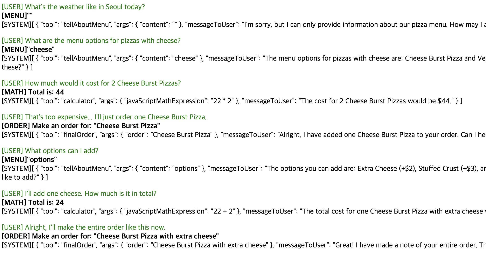
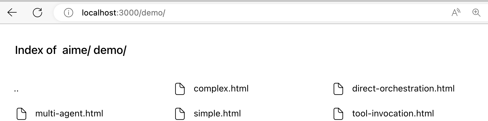

AI application development often requires a balance between leveraging the power of AI and maintaining object-oriented programming principles. Traditional frameworks like LangChain and Semantic Kernel offer robust solutions but may require developers to adapt their design patterns to fit the AI integration model.

# Langobject Framework
The langobject framework aims to integrate AI capabilities into applications without compromising the object-oriented design. It does so by wrapping existing classes with AI-enhanced proxies that intercept method calls and optionally redirect them to AI services for processing. This approach allows developers to add AI functionalities with minimal changes to the existing codebase.

Consider the following example where an existing Writer class method generateJoke is enhanced with AI capabilities using langobject:

1. Define a Class
```js
    class Writer{  //define persona
        generateJoke(topic, write_in_spanish){}  //define mission, user inputs, and criticism (_)
    }
```
 will produce such prompt: "As a Writer, please generate a joke for the topic and DON'T FORGET: write in spanish" 

2. Make it AI-powered

```js
    let writer = langobject(new Writer())  //create AI version of Writer
```

3. Use anywhere
```js
    writer.generateJoke("a cute dog").then(joke => alert(joke));
```
will invoke the LLM (OpenAI by default) and returns the result as the function return value

In this example, the Writer class remains unchanged, preserving its object-oriented design. The langobject framework wraps the Writer instance, providing an AI-enhanced proxy that can intercept the generateJoke method call and process it using AI services.

> Try it live: https://playcode.io/1769495

#### Comparison
- LangChain and Semantic Kernel offer comprehensive solutions for AI integration but may require adapting your application's architecture to fully leverage their capabilities.


```py
    def generate_joke(topic, language):
        prompt = f"As a professional Writer, Generate a joke about {topic} in {language}."
        response = llm(prompt)
        return response

    chain = SingleComponentChain(generate_joke)
    joke = chain.run("a cute dog", "Korean")

    print(joke)
```


- langobject Framework focuses on minimally invasive integration, allowing developers to maintain their object-oriented design while adding AI functionalities. This approach is particularly beneficial for applications where preserving the existing architecture and design patterns is crucial.

In summary, the langobject framework provides a unique solution for integrating AI into applications with minimal disruption to object-oriented principles, offering a contrast to the more invasive integration strategies required by frameworks like LangChain and Semantic Kernel.


# Usages
```
npm i langobject
```
and try following examples:


#### Specifying Prompt

While the default behavior is to automatically generate prompts from the method name and parameters, this example uses a given prompt to request a joke. It explicitly forms the request string, providing more control over the AI's input.

```js
    class Publisher{
        //derives the prompt from the method and parameter names
        generateJoke(topic, language){} 
        
        //use the given prompt
        generateAnotherJoke(topic, language){  
            return `    
                please generate a joke for ${topic} in ${language} language. 
            `
        }

        //using given prompt and returns JSON object
        generateJsonJoke(topic, language){
            return `    
                please generate a joke for ${topic} in ${language} language. 
            
                result must be in JSON format:
                \`\`\`
                {
                    title: title of joke,
                    content: content of joke
                }
                \`\`\`
            `
        }

    }

    const publisher = langobject(new Publisher());

    publisher.generateJsonJoke("a cute dog", "Korean")
        .then(
            result => document.write(result.content)
        )

```

##### Example: Form Generator
This example demonstrates how to dynamically generate a form using the VueJS framework with the help of a `Vue2Expert` class. The class includes a method `createForm` that takes an array of field definitions and returns a Vue component template for a form. The `createForm_sanitizeOutput` method is used to sanitize the output, ensuring that only the template content is returned. 
The `return_only_code__without_any_explanation` argument instructs the method to exclude any additional explanations beyond code generation.(Arguments with '_' in their names are identified as additional directives for the prompt)
    

```html
<script src="https://cdn.jsdelivr.net/npm/vue@2"></script>

<div id="app"></div>

<script type="module">
    import langobject from '../src/langobject.js'
    
    class Vue2Expert{
        createForm(fields, return_only_code__without_any_explanation){
        }

        createForm_sanitizeOutput(text){
            const templateContentMatch = text.match(/<template>(.*?)<\/template>/gs);
            return templateContentMatch ? templateContentMatch[0].replace(/<template>|<\/template>/gs, '') : '';
        }
    }

    (async ()=>{

        let expert = new Vue2Expert()
        
        let result = await langobject(expert).createForm([
            {fieldName: 'Name', type: 'string', mandatory: true},
            {fieldName: 'RegistrationDate', type: 'date', mandatory: true},
            {fieldName: 'NumberOfPeople', type: 'int', default: 2},
        ], true)

        // Register result as a Vue component
        Vue.component('dynamic-form', {
            template: result
        });

        // Create a new Vue instance and mount it to #app to render the dynamic component
        new Vue({
            el: '#app'
        });
    })()

</script>
```
If you desire the outcome for Vue3, simply changing the class name from Vue2Expert to Vue3Expert works like magic.


#### Streaming
This example showcases how to stream content to a webpage using the `Writer` class. The `Writer` class includes a method `writeLongStory` that takes a topic and language as arguments, and optionally, a directive to write the content in HTML format. The `stream` method is then used to output chunks of the story directly to the document.

```js
    import langobject from 'langobject'
  
    class Writer{
        writeLongStory(topic, language, please_write_in_html){} 

        stream(chunk){
            document.write(chunk)
        }

    }

    const writer = langobject(new Writer());

    window.onload = function() {
        writer.writeLongStory("a heroic dog", "Korean")
    }
    
```

The process begins with importing a customized `langobject` module, which presumably enhances the `Writer` class with additional capabilities, such as AI-driven content generation. Upon the window's load event, the `writeLongStory` method is invoked with a specific topic and language, initiating the streaming of the story content to the webpage.

This example demonstrates a dynamic and interactive way of presenting content, where the story is generated and displayed in real-time, providing an engaging user experience.

#### Orchestration and Memory
This example illustrates direct orchestration where a Director class orchestrates the workflow between a Writer class, which generates a joke, and a WebPageEditor class, which creates an HTML page based on the joke. The Director class directly manages the interaction between these two classes.

```js
    
    class WebPageEditor{
        createHtmlPage(joke){}
    }

    class Writer{
        generateJoke(topic, language){} 
    }

    class Director{
        constructor(){
            this.writer = langobject(new Writer());
            this.webPageEditor = langobject(new WebPageEditor());
            this.scratchpad=''
        }

        async direct(topic){
            this.scratchpad = await this.writer.generateJoke(topic, "Korean")
            let page = await this.webPageEditor.createHtmlPage(this.scratchpad)

            return (page)
        }
    }

    const publisher = new Director();

    publisher.direct("a cute dog").then(result => document.write(result))

```


#### Tool Invocation


This example showcases how to create an interactive order-taking. The assistant is capable of presenting the menu, calculating the total cost of an order, and responding to user queries in a simulated conversation.


```js
import langobject from 'langobject'

class OrderTaker{
    constructor(){
        this.messages = [{
            role: "system",
            content: `

You are a clerk taking orders at a pizza shop. The menu is as follows:

- Cheese Burst Pizza: $22
- Pepperoni Pizza: $25
- Veggie Delight Pizza: $18
- Hawaiian Pizza: $23
- BBQ Chicken Pizza: $24
- Options:
    * Extra Cheese: +$2
    * Stuffed Crust: +$3
    * Extra Toppings: +$4
                    
`
        }];

        this.tools = [this.tellAboutMenu, this.finalOrder, this.calculator]
    }

    respondToUser(userRequest){}

    tellAboutMenu(content){
        document.write("<b>[MENU]" + JSON.stringify(content) +"<br></b>")
    }

    finalOrder(order){
        document.write("<b>[ORDER] Make an order for: " + JSON.stringify(order) +"<br></b>")
    }

    calculator(javaScriptMathExpression){
        document.write("<b>[MATH] Total is: " + eval(javaScriptMathExpression) +"<br></b>")
    }

}

const orderTaker = langobject(new OrderTaker());

async function talk(msg){
    document.write("<span style='color:green;'>[USER] "+ msg +"</span><br>")
    document.write("[SYSTEM]" + await orderTaker.respondToUser(msg) +"<p>")
}


window.onload = (event) => {
    (async ()=>{
        await talk("What's the weather like in Seoul today?")

        await talk("What are the menu options for pizzas with cheese?")
        await talk("How much would it cost for 2 Cheese Burst Pizzas?")
        await talk("That's too expensive... I'll just order one Cheese Burst Pizza.")

        await talk("What options can I add?")
        await talk("I'll add one cheese. How much is it in total?")
        await talk("Alright, I'll make the entire order like this now.")


    })()
};


```

The `OrderTaker` class is designed to simulate an order-taking clerk at a pizza shop. It includes methods for displaying the menu 1, finalizing the order 2, and calculating the total cost 3. The class uses the langobject framework to enhance its capabilities, allowing it to process and respond to user requests in a more dynamic and AI-driven manner.

- `Menu and Tools Initialization`: The constructor initializes the menu and a list of tools (this.tools) that the OrderTaker can use to interact with the user. These tools include methods for telling about the menu, finalizing orders, and performing calculations.

- `Responding to User Requests`: The respondToUser method is intended to process user requests. Although its implementation is not shown, it would typically involve analyzing the user's input and determining the appropriate response or action to take.

- `Menu Presentation`: The tellAboutMenu method displays the pizza shop's menu to the user. It formats the content as a bolded JSON string for clarity.

- `Order Finalization`: The finalOrder method is used to confirm the user's order, displaying it in a structured format.

- `Cost Calculation`: The calculator method evaluates a JavaScript mathematical expression to calculate the total cost of an order. This demonstrates how the application can perform dynamic calculations based on user input.
Interaction Flow


Usage Scenario




#### Multi-Agent (ToDo)
This example shows a multi-agent system where a Scheduler class creates a schedule that includes multiple agents (Planner and Calculator). It demonstrates a pattern for orchestrating tasks among multiple agents, where each agent has a specific role or function.

```js
    
    class Scheduler{
        createSchedule(topic){
            return {
                "co-workers": [Planner, Calculator]
            }
        }
    }

    class Calculator{
        calculate(expression){}
    }

    class Planner{
        plan(topic){}
    }

    document.write(langobject(new Scheduler()).createSchedule("4 days trip for South Korea"))
```

# How to try

```
npm run serve
```

Please navigate to http://localhost:3000/demo/ in your browser. Once there, open the browser's console and set your OpenAI API key by executing localStorage.setItem('OPENAI_API_KEY', 'sk...'). Afterward, proceed to the src folder and try running the various HTML files available there.


